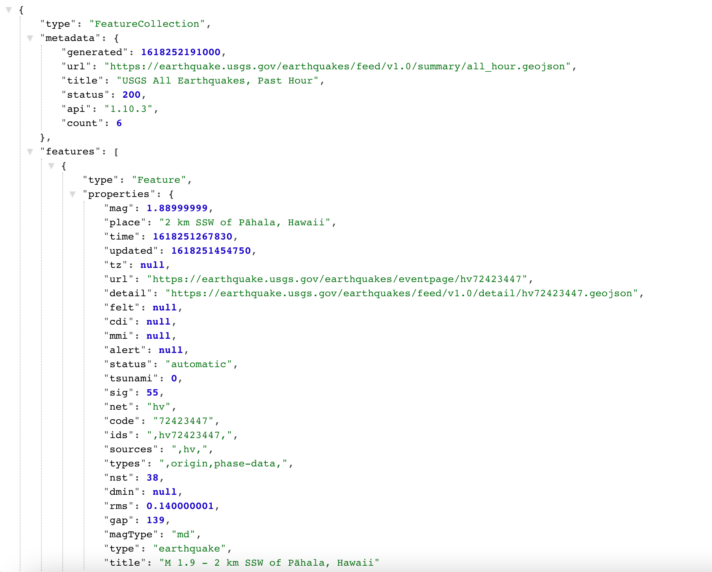
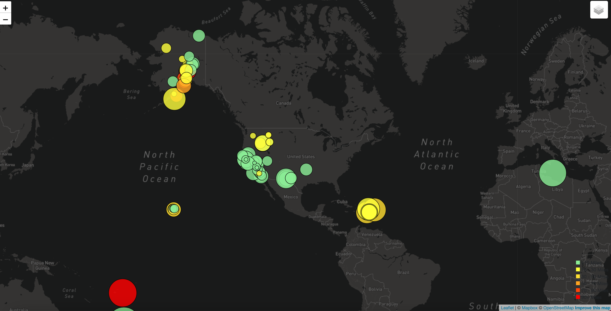

# Visualizing Data with Leaflet

### https://alexarnold630.github.io/SMU_Homework/17-Mapping-Web/Submission/index.html

## Background

The USGS is responsible for providing scientific data about natural hazards, the health of our ecosystems and environment; and the impacts of climate and land-use change. Their scientists develop new methods and tools to supply timely, relevant, and useful information about the Earth and its processes. 

The USGS is interested in building a new set of tools that will allow them visualize their earthquake data. They collect a massive amount of data from all over the world each day, but they lack a meaningful way of displaying it. Their hope is that being able to visualize their data will allow them to better educate the public and other government organizations (and hopefully secure more funding..) on issues facing our planet.

## Technologies Used
- Leaflet
- HTML5/ CSS
- Javascript

## Objectives

- Select data set

   The USGS provides earthquake data in a number of different formats, updated every 5 minutes. Visit the [USGS GeoJSON Feed](http://earthquake.usgs.gov/earthquakes/feed/v1.0/geojson.php) page and pick a data set to visualize. 

- Create a map using Leaflet that plots all of the earthquakes from your data set based on their longitude and latitude.

- Data markers reflect the magnitude of the earthquake by their size and and depth of the earth quake by color. Earthquakes with higher magnitudes appear larger and earthquakes with greater depth appear darker in color.

- Popups provide location data and size of earthquake when clicked upon.

### Contact
Alex Arnold: alexnarnold630@gmail.com

